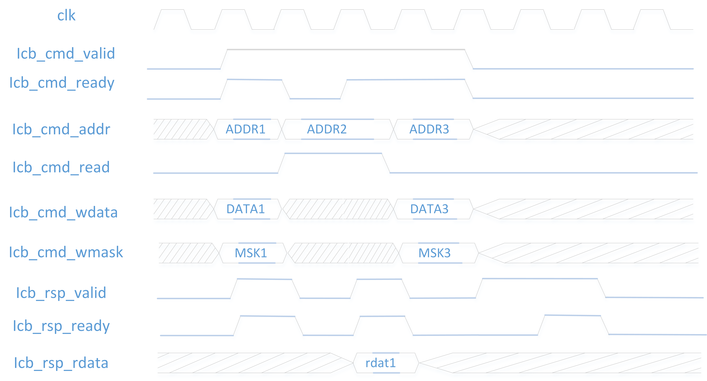

# DDR3
### 目录
#### 一. 主要更改
#### 二. 注意事项
#### 三. ICB总线学习
#### 四. 仿真测试
****
## 一. 主要更改
对于DDR3控制器，通过网上的检索，发现主流的方案是采用MIG IP核来生成DDR3控制器。因此本设计中也采用了MIG IP核。关于如何将控制器 IP核嵌入到SoC平台中，这是一个需要思考的问题。因为不像EMAC外设，接口时钟和CPU的内核时钟是同一个时钟。对于DDR3控制器 IP核的接口时钟却是IP核自己生成的时钟。这里面就可能存在跨时钟域的问题。同时接口的数据位宽是128位的，与CPU内核的32位位宽不匹配。这里提供两种思路：  

思路一：应用成熟的IP核和AXI接口，思路一非常的稳定和可靠。 
  

思路二：自己写一个ICB到DDR3 native interface的桥接协议。要同时解决跨时钟域，和数据位宽的问题。为了更好的学习ICB总线协议，同时这也是一个练习跨时钟域处理的好机会，因此我们选择了思路二。对于思路二其实E203也为我们提供了跨时钟域的桥接模块：sirv_gnrl_cdc_rx和sirv_gnrl_cdc_tx。不过我们也没有使用，原因前面也提到了。

具体的更改如下：
1. RTL：在E203内核的LSU中，给DCACHE留了ICB接口，但外部并没有接DCACHE设备，我们就利用这个接口来做内存扩容。ICB接口参见[e203_lsu.v](rtl/core/e203_lsu.v)。同时我们在[e203_lsu.v](rtl/core/e203_lsu.v)实例化了我们的桥接协议[ICBBridge](rtl/icb_bridge.v)。有关桥接协议的更详细信息，请 doc 目录下的相关文档。有了桥接协议之后MIG 的83MHz 的native interface 就变成了16.6MHz 的ICB interface。从而能够从LSU接收访存指令，并能够将读到的数据传递给写回模块。  
之后我们需要把native interface 的信号引出到顶层模块。并在顶层模块实例化DDR3 控制器。这就是我们的主要步骤。因为在ICBBridge中我们已经加入了对ICB cmd和 rsp的缓存因此，桥接外层无需加入缓冲模块也能够满足时序要求。

2. IP核：primary clock 依然是板载的晶振产生的100 MHz时钟。源时钟进入MMCM产生sys_clk_i(166.667 MHz)和clk_ref_i(200 MHz)给DDR3控制器。DDR3控制器的输出时钟ui_clk(83.333 MHz)再次作为源时钟进入MMCM2中产生16.666 MHz的系统时钟和8.388 MHz时钟。  
另一个需要关注的IP核是MIG。有关MIG的各种信息请参考doc目录下的product guide。同时，在IP目录下有mig.prj文件，您可以通过这个文件直接生成MIG 核。需要注意的是，如果您需要native interface（UI interface）的话，您还需要在GUI环境下，重新更改interface设置，并重新生成IP核。如果选择AXI接口就无需上述操作。
3. 约束文件：增加了[mig_7series_0.xdc](constraint/mig_7series_0.xdc)作为与DDR3接口的引脚的物理约束。增加了[example_top.xdc](constraint/example_top.xdc)设置了内部参考电压。
## 注意事项
1. 使用MIG IP核的时候，该IP核会产生一个时钟ui_clk。需要注意的是这个时钟和他的时钟源 sys_clk_i 的相位是不一致的。这是我在行为级仿真的时候发现的。后来仔细检查了一下report，发现人家本来就给我报了warning。在论坛上问了一下，得到的答复是这个warning是正常的，可以忽略的。不过，对于我们的这个跨时钟域设计，相位的不一致还是会造成很多困扰。所以我们更改了时钟生成的方案。
2. E203采用的是两级流水线，也就是取指之后就没有寄存器帮我们缓存数据了，所以当数据从译码阶段，到派遣再到执行，再到我们接口的ICB信号。所以很有必要在核LSU的接口插入一级寄存器，同理在和协会模块的ICB宗信啊通信上最好也加上一级流水。这个我们最早的设计没有考虑，所以综合后，很多setup 是违背的。有关如何在ICB总线上插入流水，请看第三部分。
3. 在我们学习SDRAM的时候知道，DRAM是需要刷新的，这个刷新，如果选择不去控制那个接口的话，对于我们来说就是透明的。刷新可能在任何时候发生。之前我们在给DDR3 控制器发送的指令时，只是在IDLE阶段判断了一下DDR3控制器是否准备好，之后就默认准备好了。发送指令和判断准备正好差了一个时钟周期。这一点是致命的，会出现前一个周期，控制器还是准备好的，下一个周期就不准备好了。这个时候发给控制器的指令没有被接收，整个CPU就stall了。
4. 说一下MASK，在E203中MASK的1，表示不屏蔽，而在DDR3的native接口上，MASK的1表示屏蔽。
5. 在E203中的地址是以字节为单位的，但在DDR3 的native 接口中，地址事宜半字为单位的。
6. DDR3的存储和E203采用的都是小端模式，这一点比较方便。
## ICB总线学习
原谅我的无知，当我第一次阅读源码的时候，E203中关于ICB总线的使用真的是非常让人震惊。在整个设计中ICB总线不仅作为连接外设，内存的接口，也是CPU各级流水线传递的接口。在我们学习计算机组成原理的时候，会学到CPU有一个部件是控制器，控制器来控制整个数据通路的流动，是否需要stall和flush流水线。整个控制器会用到非常复杂的组合逻辑。而在E203中将控制器的作用分散到来不同模块，比如译码，派遣，交付，写回，都会执行控制器的一部分作用。其中ICB总线也完成了控制流水线stall的部分功能。并且这种stall并不是全局的stall，它只会stall自己所在的那条支路，然后这种stall就会向前传递，直到这条支路已经堵塞了太多指令，堵到了主干路，那么整个CPU就被stall了。真是天才的构想，钦佩不已。  
ICB总线的接口时序更详细的介绍可以参考《手把手教你设计CPU——risc-v处理器》。按照作者的介绍ICB总线是对AXI接口的简化。ICB总线涉及到的主要信号如下：   
|通道|方向|信号名|介绍|
|:---|:---|:---|:---|
|命令通道|output|icb_cmd_valid|主设备向从设备发送的读写请求信号|
||input|icb_cmd_ready|从设备向主设备返回读写接收信号|
||output|icb_cmd_addr|读写地址|
||output|icb_cmd_read|读或者写操作的指示|
||output|icb_cmd_wdata|写操作的数据|
||outout|icb_cmd_wmask|写操作的字节掩码|
|反馈通道|input|icb_rsp_valid|从设备向主设备发送读写反馈请求信号|
||output|icb_rsp_ready|主设备向从设备返回读写反馈接收信号|
||input|icb_rsp_rdata|读反馈数据|
||input|icb_rsp_err|读或者写错误标志|  

当然这些信号并不是全部，完全可以根据自己的需要增加新的信号。一个典型的ICB总线读写过程如下：  
  
当我们有一个读写请求的时候，icb_cmd_valid拉高，直到icb_cmd_ready拉高后，表示此次命令传递成功，在下一个时钟周期valid和ready都拉低。当icb_cmd_ready为低时，icb_cmd_valid就会持续拉高直到两个信号同时为高。  
当从设备完成数据处理或者读数据准备好后会将icb_rsp_valid拉高，直到icb_rsp_ready也同时为高时，表示这次握手成功，两个信号再次被拉低。

下面我们来说一下如何在ICB总线的传输路径上插入一级缓存。